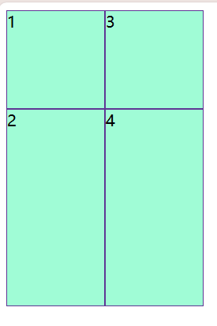
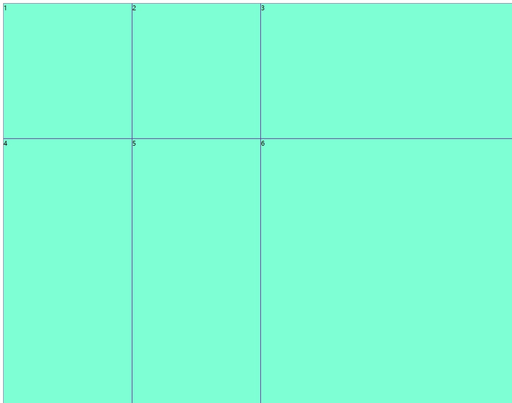
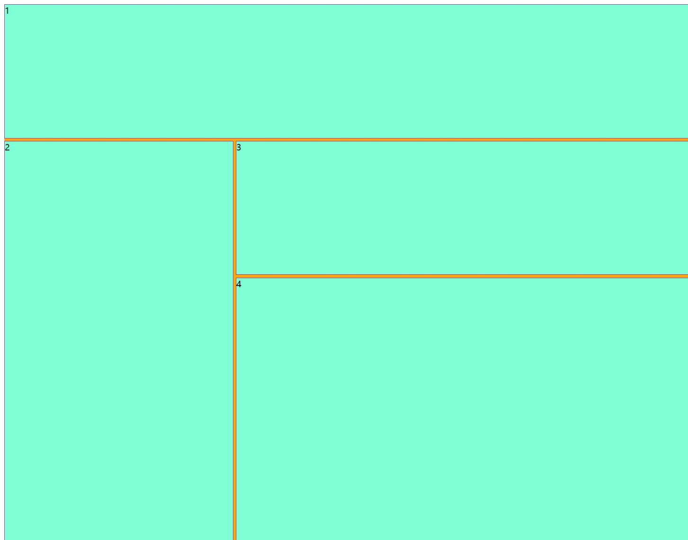

+++
date = '2025-02-22T16:50:39+08:00'
draft = true
title = '大数据可视化【前端】'

image = "page/anli.png"

+++

## flex布局 

- **Flex布局，又称弹性布局，是一种CSS布局方式。它提供了一种更灵活的方式来对容器中的项目进行布局、对齐和分配空间，即使容器大小动态变化，也能保证布局的稳定性。Flex布局的知识要点主要分为容器属性和项目属性两部分。**

### flex-direction属性

```javascript
 flex-direction: column; #从上到下对齐
 flex-direction: column-reverse; #从下到上对齐
 flex-direction: row; #从左到右对齐 （默认）
 flex-direction: row-reverse; #从右到左对齐
```

### **flex**

- **flex-grow、flex-shrink和flex-basis的简写属性。**
- **默认值为0 1 auto**

```javascript
.container{
    width: 100%;
    height:98%;
    display: flex;
    background-color: blueviolet;
}
.item{
    flex: 1;
    background-color: aqua;
    border: 1px solid white;
}
.item1{
    flex: 2;
    background-color: aqua;
    border: 1px solid white;
}
```


```javascript
<template>
<div class="container">
    <div class="item" style="flex: 0 1 30%;">1</div> #可以在标签设置内百分比
    <div class="item" style="flex: 0 1 40%;">2</div>
    <div class="item" style="flex: 0 1 30%;">3</div>
</div>
</template>

<script setup>

</script>

<style scoped>
.container{
    width: 100%;
    height:98%;
    display: flex;
    background-color: blueviolet;
}
.item{
    flex: 1;
    background-color: aqua;
    border: 1px solid white;
}
</style>
```


.containter为父元素盒子——item为子元素盒子

flex定义父元素盒子为弹性盒子（flex为从横向排列，默认为上下排列）

```javascript
.container {
  display: flex;
  /* 其他样式，如方向、换行、对齐等 */
  flex-direction: row; /* 可以是 row 或 column */
  flex-wrap: wrap;     /* 可以是 nowrap, wrap, 或 wrap-reverse */
  justify-content: space-between; /* 子元素在主轴上的对齐方式 */
  align-items: center; /* 子元素在交叉轴上的对齐方式 */
}
```

flex在子元素盒子中控制子元素的布局

```javascript
.item {
  flex: 1; /* 等同于 flex-grow: 1; flex-shrink: 1; flex-basis: 0%; */
  /* 或者更具体的设置 */
  flex-grow: 2; /* 子元素可以增长的空间比例 */
  flex-shrink: 1; /* 子元素可以缩小的空间比例 */
  flex-basis: auto; /* 子元素的起始大小 */

  /* 其他样式 */
  margin: 10px;
  padding: 20px;
}
```

### **flex-shrink**

- **定义项目的缩小比例。默认为1，表示当容器空间不足时，项目会按比例缩小。如果设置为0，则项目在空间不足时不会缩小。**

### **flex-basis**

- **定义项目在分配多余空间之前占据的主轴空间（main size）。**
- **默认值为auto，即项目的本来大小。也可以设置为具体的长度值。**

### **align-self**

- **允许单个项目有与其他项目不一样的对齐方式。**
- **l 可选值与align-items相同，但此属性仅作用于单个项目，可以覆盖容器的align-items属性。**

### flex-wrap

- **定义容器内的项目是否可换行。**
- **可选值：nowrap（默认值，不换行）、wrap（换行，第一行在上方）、wrap-reverse（换行，第一行在下方）。**

### **flex-flow**

- **flex-direction和flex-wrap的简写属性**

## Grid布局

**Grid布局是CSS中一种强大的二维布局系统，它允许开发者将页面划分为行和列，并指定元素在这些行和列中的位置。以下是对Grid布局知识要点的归纳，分为容器属性和项目属性，并附上示例：**

### **display**属性

-  **grid：将元素设置为块级网格容器。**
-  **inline-grid：将元素设置为行内网格容器。**
-  **subgrid：继承父元素的grid布局。**

### **grid-template-columns/grid-template-rows属性**

-  **定义网格的列数和行数及其大小。可以使用长度单位（如px、em等）、百分比（%）或fr单位（表示剩余空间的比例分配）。**
-  **示例：.grid-container { display: grid; grid-template-columns: 100px 1fr 2fr; grid-template-rows: repeat(3, 100px); }**

#### <u>**grid-column/grid-row**</u>

*是grid-column-start和grid-column-end（或grid-row-start和grid-row-end）的简写形式。*

*示例：.item { grid-column: 2 / 4; grid-row: 1 / 3; } 或 .item { grid-column: span 2; grid-row: span 1; }（表示跨越2列，1行）*

```html
<!DOCTYPE html>
<html lang="en">
<head>
    <meta charset="UTF-8">
    <meta name="viewport" content="width=device-width, initial-scale=1.0">
    <title>Document</title>
    <style>
        .container{
            display: grid;
            grid-template-columns: 100px 100px;
            grid-template-rows: 100px 200px;
            grid-auto-flow: column;
        }
        .item{
            background-color: aquamarine;
            align-items: center;   /* 对齐方式 */
            justify-content: center;
            border: 1px solid rebeccapurple;
         }
    </style>
</head>
<body>
    <div class="container">
        <div class="item">1</div>
        <div class="item">2</div>
        <div class="item">3</div>
        <div class="item">4</div>
    </div>
</body>
</html>
```



```html
<style>
        html,body{
            height: 100%;
            width: 100%;
        }
        .container{
            height: 100%;
            width: 100%;
            display: grid;
            grid-template-columns: 1fr 1fr 2fr;
            grid-template-rows: 1fr 2fr;
            
        }
        .item{
            background-color: aquamarine;
            align-items: center;   /* 对齐方式 */
            justify-content: center;
            border: 1px solid rebeccapurple;
         }
    </style>
</head>
<body>
    <div class="container">
        <div class="item">1</div>
        <div class="item">2</div>
        <div class="item">3</div>
        <div class="item">4</div>
        <div class="item">5</div>
        <div class="item">6</div>
    </div>
</body>
```



```html
grid-template-columns: repeat(6,1fr);
grid-template-rows:repeat(2,1fr);
```


### gap属性

- **设置网格行和列之间的间距。是grid-column-gap和grid-row-gap的合并简写形式。可以接受两个值：第一个值表示行间距，第二个值表示列间距（如果仅提供一个值，则行间距和列间距相同）。**


将行列合并

```html
<!DOCTYPE html>
<html lang="en">
<head>
    <meta charset="UTF-8">
    <meta name="viewport" content="width=device-width, initial-scale=1.0">
    <title>Document</title>
    <style>
        html,body{
            height: 100%;
            width: 100%;
        }
        .container{
            gap: 5px;
            height: 100%;
            width: 100%;
            display: grid;
            grid-template-columns: 1fr 2fr;
            grid-template-rows: 1fr 1fr 1fr;
            grid-column-start: 2 ;
            background-color: orange;
            
        }
        .item{
            background-color: aquamarine;
            align-items: center;   /* 对齐方式 */
            justify-content: center;
            border: 1px solid rebeccapurple;
         }
         .item1{
            grid-row: 1/2; 
            /* 合并第一行到第二行 */
            grid-column: 1/3;
            /* 合并第一列到第三列 */
         }
         .item4{
            grid-column: 1/3;
         }
    </style>
</head>
<body>
    <div class="container">
        <div class="item item1">1</div>
        <div class="item item2">2</div>
        <div class="item item3">3</div>
        <div class="item item4">4</div>
    </div>
</body>
</html>
```


### **grid-template-areas属性**

- **通过命名网格区域来布局网格项目。需要在子元素上使用grid-area属性指定其所属区域。**
- **示例：.grid-container { display: grid; grid-template-columns: repeat(3, 100px); grid-template-rows: repeat(3, 100px); grid-template-areas: 'a a a' 'b c d' 'e e f'; } .item1 { grid-area: a; }**

#### <u>***grid-column-start/grid-column-end/grid-row-start/grid-row-end***</u>

-  *通过指定项目在网格中的起始和结束行列位置来定位项目。*
-  *示例：.item { grid-column-start: 2; grid-column-end: 4; grid-row-start: 1; grid-row-end: 3; }*

####  **grid-area**

- *直接定义网格区域，可以指定项目的起始行列、跨越行列数或命名区域。*
- *示例：.item { grid-area: 2 / 2 / span 2 / span 2; } 或 .item { grid-area: namedArea; }（namedArea为grid-template-areas中定义的命名区域）*

```html
.item1{
            grid-area: 1/1/2/3;
         }
.item4{
     grid-area: 3/1/4/3;
   /* 起始行/起始列/结束行/结束列 */
         }
```

效果和分开相同

案例：

```html
<style>
        html,body{
            height: 100%;
            width: 100%;
        }
        .container{
            gap: 5px;
            height: 100%;
            width: 100%;
            display: grid;
            grid-template-columns: 1fr 1fr 1fr;
            grid-template-rows: 1fr 1fr 1fr 1fr;
            grid-column-start: 2 ;
            background-color: orange;
            
        }
        .item{
            display: flex;
            background-color: aquamarine;
            align-items: center;   /* 对齐方式 */
            justify-content: center;
            border: 1px solid rebeccapurple;
         }
         .item1{
            grid-area: 1/1/2/4;
         }
         .item2{
            grid-area: 2/1/5/2;
         }
         .item3{
            grid-area: 2/2/3/4;
         }
         .item4{
            grid-area: 3/2/5/4;
         }
    </style>
</head>
<body>
    <div class="container">
        <div class="item item1">1</div>
        <div class="item item2">2</div>
        <div class="item item3">3</div>
        <div class="item item4">4</div>
    </div>
</body>
</html>
```



### **grid-auto-flow属性**

- **设置容器子元素的放置在网格中的顺序。默认值是row，即“先行后列”，也可以设为column，变成“先列后行”**

### **grid-auto-columns/grid-auto-rows**

- **定义容器中多余网格的列宽、行高**

### **place-self**

- **设置某个项目的对齐方式，可以覆盖容器级别的对齐设置。**
- **示例：.item { place-self: center; }（表示在单元格中居中对齐）**


## Echarts

官网网址：[Apache ECharts](https://echarts.apache.org/zh/index.html)

安装插件：

```vue
yarn add echarts axios
```

在组件文件夹建立chart文件夹(存放图表组件)

### 可视化图的使用

1. 引入

2. 在template内导入容器

   ```vue
   <template>
   <div ref="chart" style="width: 100%;height:400px;"></div>
   </template>
   ```

3. 写入图像配置

   ```vue
   <script setup>
   import { ref, onMounted,reactive } from 'vue';
   import * as echarts from 'echarts';
   let chart = ref() //定义一个变量chart响应式数据，用于存放echarts实例
   onMounted(()=>{
       chartInit()
   }) //挂载到chartInit上
   function chartInit(){
       var myChart = echarts.init(chart.value) //chart.value获取到的是div元素，然后初始化echarts实例
       var option = {
           title:{
               text:'我的第一个图',
               link:'www.baidu.com'
           },
           tooltip:{},//提示框
           legend:{
           },//图例
           xAxis:{
               data:['一月','二月','三月','四月','五月']
           }
           ,//x轴
           yAxis:{
   
           },//y轴
           series:[   
               {
                   name:'月度排名',
                   type:'bar',
                   data:[20,30,40,50,60]
           }//数据
       ]
       }
   myChart.setOption(option) //设置图表的配置项和数据
   }
   
   </script>
   ```

### 主题使用

### 扩展插件的使用

加时间，天气预报，选项卡

### Echarts图表

y轴双轴，x轴双轴的设置

```javascript
需要const colors = [.....] //颜色数组
option = {
....
yAxis: [{
            type: 'value',
            name: '数量',
            position: 'right',
            axisLine: {
                show: true,
                lineStyle: {
                    color: colors[0]
                }
            }
        }, {
            type: 'value',
            name: '百分比',
            alignTicks: true,
            axisLine: {
                show: true,
                lineStyle: {
                    color: colors[2]
                }
            }
        }]
....
}
```

```javascript
xAxis: [
    {
      type: 'category',
      data: ['2016-1', '2016-2', '2016-3', '2016-4', '2016-5', '2016-6', '2016-7', '2016-8', '2016-9', '2016-10', '2016-11', '2016-12']
    },
    {
      type: 'category',
      data: ['2015-1', '2015-2', '2015-3', '2015-4', '2015-5', '2015-6', '2015-7', '2015-8', '2015-9', '2015-10', '2015-11', '2015-12']
    }
  ]
```

图像布局

```
var option = {
        grid: {
            top: '15%',
            left: '3%',
            right: '4%',
            bottom:  '3%',
            containLabel: true //包含坐标轴的刻度标签
        }
  ...
  }
```


## 项目流程

### 拟定题目

### 设计框架布局

### 寻找数据

连接数据库试运行

### 自己可以先跑一下（后台有数据库）

