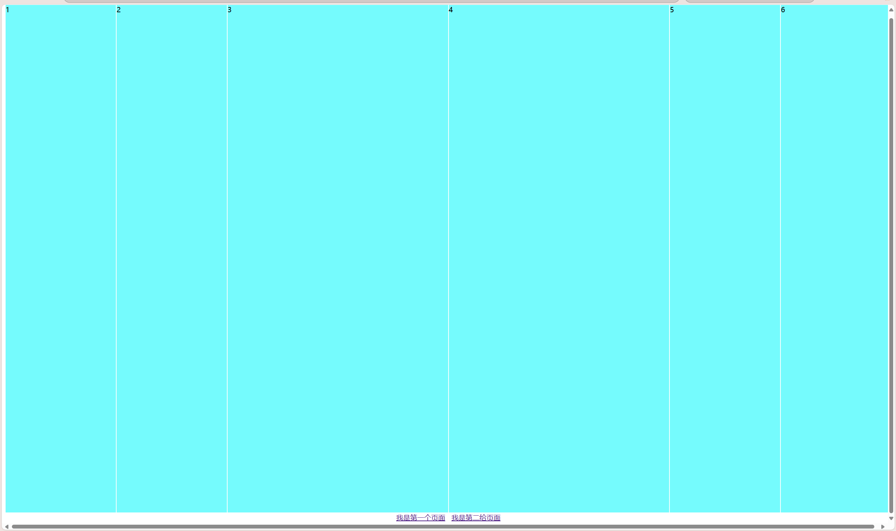
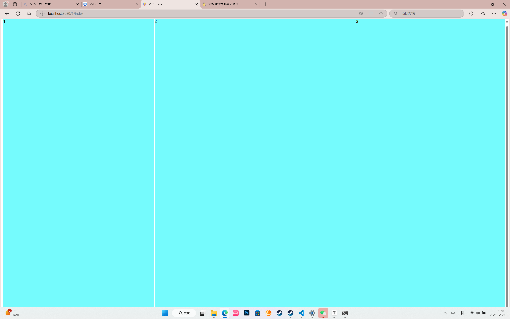

+++
date = '2025-02-22T16:50:39+08:00'
draft = true
title = '大数据技术可视化项目'

image = "page/anli.png"

+++

## flex布局

### flex-direction属性

```javascript
 flex-direction: column; #从上到下对齐
 flex-direction: column-reverse; #从下到上对齐
 flex-direction: row; #从左到右对齐 （默认）
 flex-direction: row-reverse; #从右到左对齐
```


```javascript
.container{
    width: 100%;
    height:98%;
    display: flex;
    background-color: blueviolet;
}
.item{
    flex: 1;
    background-color: aqua;
    border: 1px solid white;
}
.item1{
    flex: 2;
    background-color: aqua;
    border: 1px solid white;
}
```



```javascript
<template>
<div class="container">
    <div class="item" style="flex: 0 1 30%;">1</div> #可以在标签设置内百分比
    <div class="item" style="flex: 0 1 40%;">2</div>
    <div class="item" style="flex: 0 1 30%;">3</div>
</div>
</template>

<script setup>

</script>

<style scoped>
.container{
    width: 100%;
    height:98%;
    display: flex;
    background-color: blueviolet;
}
.item{
    flex: 1;
    background-color: aqua;
    border: 1px solid white;
}
</style>
```



.containter为父元素盒子——item为子元素盒子

flex定义父元素盒子为弹性盒子（flex为从横向排列，默认为上下排列）

```javascript
.container {
  display: flex;
  /* 其他样式，如方向、换行、对齐等 */
  flex-direction: row; /* 可以是 row 或 column */
  flex-wrap: wrap;     /* 可以是 nowrap, wrap, 或 wrap-reverse */
  justify-content: space-between; /* 子元素在主轴上的对齐方式 */
  align-items: center; /* 子元素在交叉轴上的对齐方式 */
}
```

flex在子元素盒子中控制子元素的布局

```javascript
.item {
  flex: 1; /* 等同于 flex-grow: 1; flex-shrink: 1; flex-basis: 0%; */
  /* 或者更具体的设置 */
  flex-grow: 2; /* 子元素可以增长的空间比例 */
  flex-shrink: 1; /* 子元素可以缩小的空间比例 */
  flex-basis: auto; /* 子元素的起始大小 */

  /* 其他样式 */
  margin: 10px;
  padding: 20px;
}
```

### flex-wrap

- 定义容器内的项目是否可换行。
- 可选值：nowrap（默认值，不换行）、wrap（换行，第一行在上方）、wrap-reverse（换行，第一行在下方）。

## Grid布局

 

```html
<!DOCTYPE html>
<html lang="en">
<head>
    <meta charset="UTF-8">
    <meta name="viewport" content="width=device-width, initial-scale=1.0">
    <title>Document</title>
    <style>
        .container{
            display: grid;
            grid-template-columns: 100px 100px;
            grid-template-rows: 100px 200px;
            grid-auto-flow: column;
        }
        .item{
            background-color: aquamarine;
            align-items: center;   /* 对齐方式 */
            justify-content: center;
            border: 1px solid rebeccapurple;
         }
    </style>
</head>
<body>
    <div class="container">
        <div class="item">1</div>
        <div class="item">2</div>
        <div class="item">3</div>
        <div class="item">4</div>
    </div>
</body>
</html>
```


```html
<style>
        html,body{
            height: 100%;
            width: 100%;
        }
        .container{
            height: 100%;
            width: 100%;
            display: grid;
            grid-template-columns: 1fr 1fr 2fr;
            grid-template-rows: 1fr 2fr;
            
        }
        .item{
            background-color: aquamarine;
            align-items: center;   /* 对齐方式 */
            justify-content: center;
            border: 1px solid rebeccapurple;
         }
    </style>
</head>
<body>
    <div class="container">
        <div class="item">1</div>
        <div class="item">2</div>
        <div class="item">3</div>
        <div class="item">4</div>
        <div class="item">5</div>
        <div class="item">6</div>
    </div>
</body>
```


```html
grid-template-columns: repeat(6,1fr);
grid-template-rows:repeat(2,1fr);
```


### gap属性

设置网格行和列之间的间距。是grid-column-gap和grid-row-gap的合并简写形式。可以接受两个值：第一个值表示行间距，第二个值表示列间距（如果仅提供一个值，则行间距和列间距相同）。


将行列合并

```html
<!DOCTYPE html>
<html lang="en">
<head>
    <meta charset="UTF-8">
    <meta name="viewport" content="width=device-width, initial-scale=1.0">
    <title>Document</title>
    <style>
        html,body{
            height: 100%;
            width: 100%;
        }
        .container{
            gap: 5px;
            height: 100%;
            width: 100%;
            display: grid;
            grid-template-columns: 1fr 2fr;
            grid-template-rows: 1fr 1fr 1fr;
            grid-column-start: 2 ;
            background-color: orange;
            
        }
        .item{
            background-color: aquamarine;
            align-items: center;   /* 对齐方式 */
            justify-content: center;
            border: 1px solid rebeccapurple;
         }
         .item1{
            grid-row: 1/2; 
            /* 合并第一行到第二行 */
            grid-column: 1/3;
            /* 合并第一列到第三列 */
         }
         .item4{
            grid-column: 1/3;
         }
    </style>
</head>
<body>
    <div class="container">
        <div class="item item1">1</div>
        <div class="item item2">2</div>
        <div class="item item3">3</div>
        <div class="item item4">4</div>
    </div>
</body>
</html>
```


## 项目流程

- ### 拟定题目

- ### 设计框架

- ### 自己可以先跑一下（后台有数据库）

