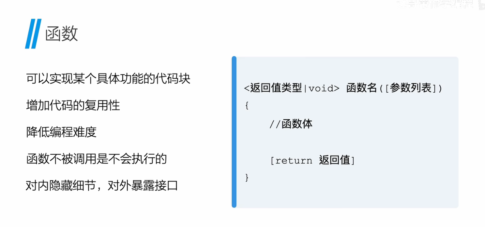
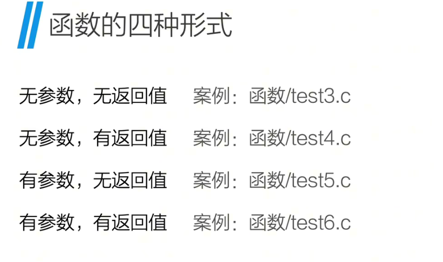
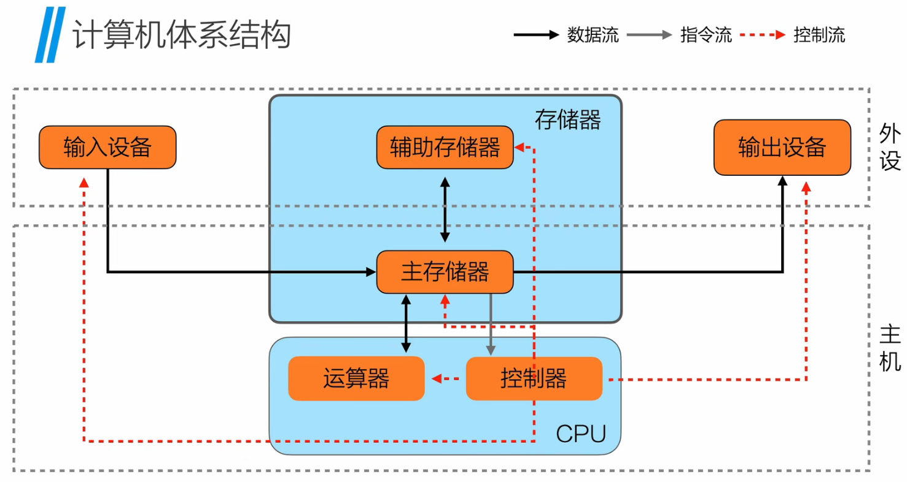
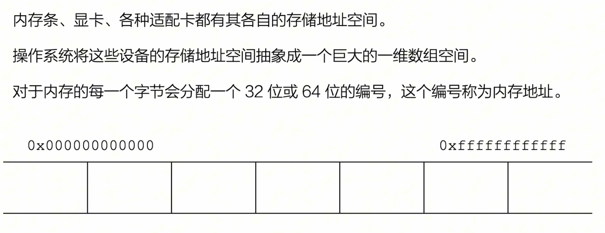
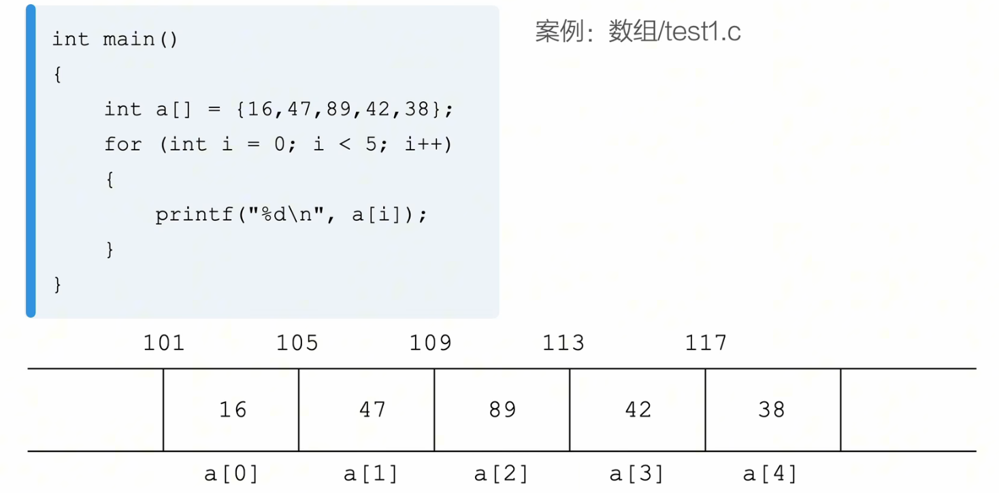
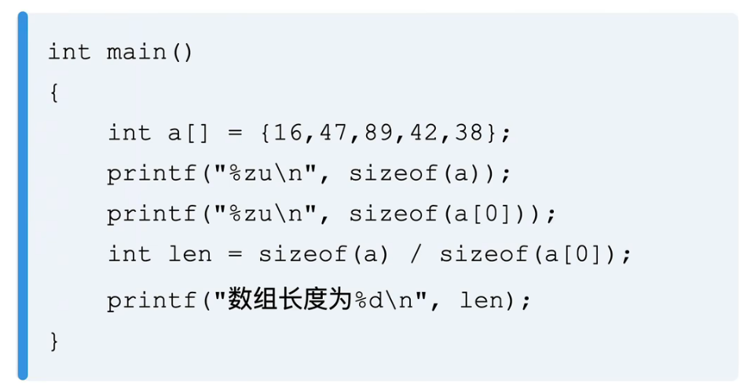
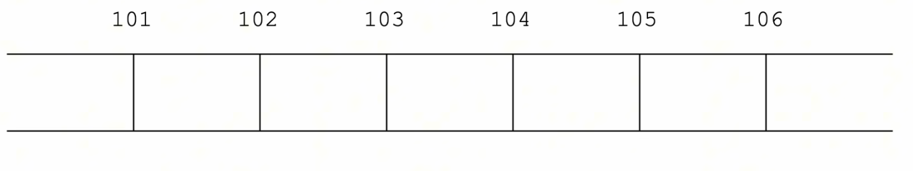
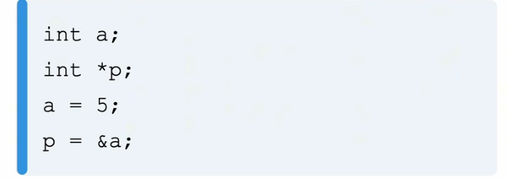
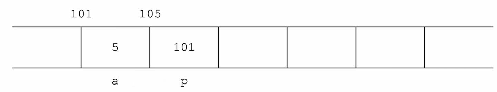
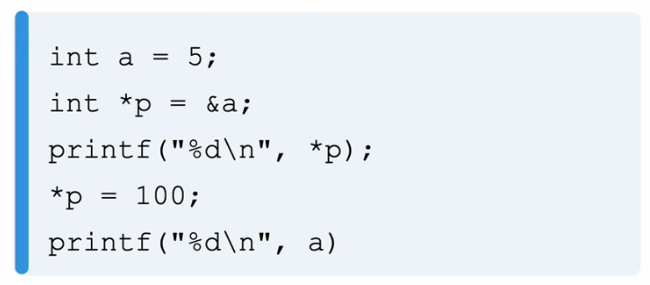

+++
date = '2026-09-28T21:33:20+08:00'
draft = true
title = '数据结构与算法'

image = "data-structure.png"

+++

# 数据结构与算法<学习>

------

## 课程地址

B站【《数据结构（C 语言描述）》也许是全站最良心最通俗易懂最好看的数据结构课】https://www.bilibili.com/video/BV1tNpbekEht?vd_source=cf8141969e1f83f7db9330b013aebc9e 进行学习

## 数据结构基本认识

### 数据结构

线性表，栈，队列，数组，树与二叉树， 图

### 算法

查找，排序

### 前置复习知识

#### 函数

#### 字符串

#### 计算机体系结构

[43：20]

#### 虚拟内存地址

[48：18]

#### 数组

[51:06]

##### 获取数组地址

[53:39]

##### 数组与sizeof

[57:02]

#### 指针

是用于存放内存地址的变量

##### 指针的声明

##### 指针的使用

声明一个变量a和一个指针p

将a的内存地址赋值给指针p

指针p存储的是a的地址

##### 简介引用操作符*

可以通过指针修改存储地址的变量的值

