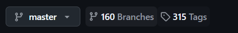
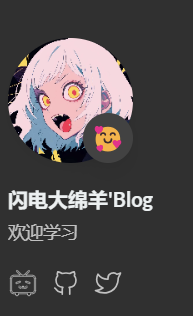

+++
date = '2025-02-21T22:11:30+08:00'
draft = true
title = '永远伟大的前端'

description = 'hugo + github 创建个人博客'

categories = [
    "编程" ,"学习"

]
tags = [
    "记录",
]

image = "girl.png"

+++

# Hugo ＋ GitHub 个人博客的建设

​	参考B站视频学习（<u>BV1bovfeaEtQ</u>）

​	hugo下载：前往hugo官网【  <u>**[The world’s fastest framework for building websites](https://gohugo.io/)**</u>  】

​	通过GitHub下载地址进行下载最新版


​	通过Themes下载自己想要的主题



​	点击tags，hugo版本选择extended版本，自己的操作系统与位数下载

​	themes直接下载最新的压缩包

<u>**[Tabler Admin Template: Responsive HTML Dashboard with Clean UI](https://tabler.io/admin-template)**</u>	SVG图标网站


## cmd控制台指令(hugo)

```
hugo new site 文件名
```

​	创建hugo的框架，其余依靠themes内主题模仿建立

```
hugo server -D
```

​	启动hugo的博客

```
hugo new content /content/post/文件夹名（blog内标题名）/文件名.md
```

​	创建文章文件    件夹解释

### assets

assets-img存放博客网站头像

assets-icons存放点击svg图片logo

### content 

**content-page**存放了左侧的点击栏【about-archives-links-search】

每一个文件夹对应一个栏，有的没有设置中文，需要修改title为中文


## 以下为hugo.yaml配置文件的解释

baseurl为博客网站地址

theme:博客主题名称

pagination:

    pagerSize: 3

博客每一页展示的文章数量

languages配置中撰写所需语言，需要考虑书写格式的缩进，会报告错

favicon为网站标签旁边的logo图标

avatar为博客头像

comment为文章下的评论（评论功能后续更新）

menu-social下配置可点击的小图标（跳转）



hugo配置文件中可以加入其他小组件（列如音乐播放器，评论功能）

可以在hugo的官方文档中查看【 [**<u>Welcome | Stack</u>**](https://stack.jimmycai.com/guide/) 】
